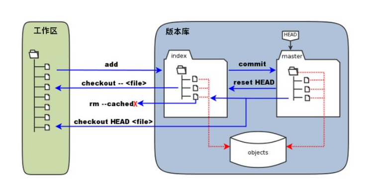

## Git

### Intro

为啥要用 Git? 首先, 你并不一定要用 Git, 或者任何的源码管理系统. 只要你:

- 有足够的 Brain Power, 知道自己在干嘛, 一周前干了啥, 当时为啥要这么干
- 有足够的耐心, 在不小心删掉写了一整天的代码之后重新写一遍
- 有足够的能力, 独立开发, 不需要深入合作; 或者能够接受使用微信 / 邮件互相发代码以同步更改

这些要求显然是很容易达到的 ~~个鬼~~, 但是 Git 为我们提供了更好的解决方案:

- 使用 Git Blame, 你可以查看每一行代码是谁写的, 以及为什么写的
- 使用 Git Log / Git CherryPick, 你可以回滚更改, 也可以将某些更改应用到其他分支
- 使用 Git Branch, 你可以在不同的分支上开发不同的功能, 多人协作, 互不干扰

### 本地仓库

首先我们介绍 Git 的本地仓库结构.

Git 的所有东西都在 `.git` 目录下. 我们一般把 **最新的项目文件和其它资源文件** (也就是 Repo 所在的文件夹除了 `.git` 之外的所有东西) 叫做 **工作区 (Working Directory)**.

在工作区中, 你可以对文件进行增删改查, 但是这些更改并不会被 Git 记录. 为了记录这些更改, 你需要这些更改添加到 **暂存区 (Staging Area)**. 暂存区中的文件会在下一次提交时被记录.

将文件添加到暂存区使用 `git add` 命令; 提交更改到本地仓库使用 `git commit` 命令.

提交之后, 你的 **更改 (Diff)** 会被记录到本地仓库中. 你可以使用 `git diff` 命令查看更改.

### 分支管理

Git 的分支管理是其最大的特色之一. 你可以在不同的分支上开发不同的功能, 互不干扰. 比如:

- `master` 分支是主分支, 用于发布稳定版本
- `dev` 分支是开发分支, 用于开发新功能和测试不太稳定的版本
- 其它分支用于开发特定功能, 比如 `feature-xxx` 分支

假设你在 `a` 分支上开发 A 功能, 你的同事在 `b` 分支上开发 B 功能; 同时你可以在 `fix_c` 分支上修复 C 功能的 Bug. 在理想的情况下, 这三个功能的开发和修复互不干扰, 可以同时进行.

### 远程仓库

除了本地仓库, Git 还支持远程仓库. **远程仓库** 是一个网络上的仓库, 你可以从远程仓库拉取代码, 也可以将本地仓库的更改推送到远程仓库.

远程仓库的地址一般是一个 URL. 使用 `git remote add` 命令添加远程仓库, 使用 `git push` 命令推送更改到远程仓库, 使用 `git pull` 命令拉取远程仓库的更改, 用 `git fetch` 命令获取远程仓库的更改但不合并到本地仓库.

远程仓库的一般访问方式有两种, HTTPS 和 SSH. HTTPS 方式一般会要求输入邮箱和 **Personal Access Token (PAT)**, SSH 方式需要配置 SSH Key (详见 SSH 章节).

### 远程仓库上的 PR 管理

以 Github 为例, 在远程仓库上, 你可以发起 **Pull Request (PR)**, 对 PR 进行评论 / 审查, 最终合并 PR 到 **目标分支**.

PR 有若干合并策略:

- FF-Only: 只允许 Fast-Forward 合并, 也就是说, 目标分支的 HEAD 必须是 PR 分支的祖先.

  

- Merge Commit: 生成一个 Merge Commit, 形成环状结构.

  

- Rebase: 将 PR 分支的更改变基到目标分支上, 然后 Fast-Forward 合并.

  

- Squash: 将 PR 分支的所有更改合并为一个 Commit, 然后 Fast-Forward 合并.

### VSCode 的 Git 支持

VSCode 的 Git 支持由 Git 插件提供; GitLens 插件包含更多的功能 (但是我没怎么用过).

